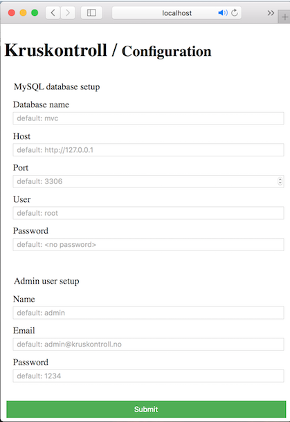
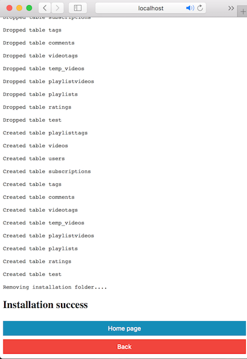
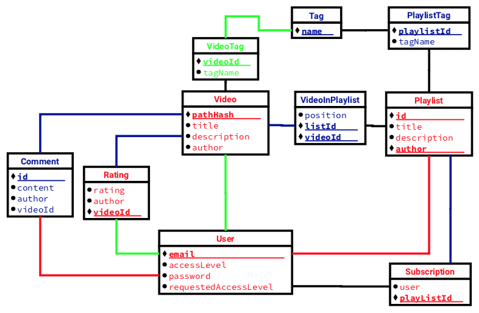

# Kruskontroll - Prosjekt 2 IMT2291 våren 2018

**Prosjektdeltakere**

Bjarte Klyve Larsen **[Klyve](https://github.com/klyve)**

Eldar Hauge Torkelsen **[fill]()**

Jonas J. Solsvik **[arxcis](https://github.com/arxcis)**


[TOC]


<br>


# Introduction

## 1. @TODO Test LIVE here
@TODO


<br>


## 2. Prerequisites

**Host system**
- MacOS, Linux or Docker (Not tested with Windows)

**Back-end**
- PHP 5.4 minimum
- Apache, nginx or similar hosts to run the project
- MySQL - for database
- Python3 - for build scripts and environment setup.


**Front-end**
- Chrome, Brave (Safari and Firefox currently not working)
- npm
- Bower


<br>


## 3. Setup Development Environment

These instructions will get you a copy of the project up and running on your local machine for development and testing purposes.


<br>


Clone repo
```
$ git clone git@bitbucket.org:klyve/imt2291-prosjekt2-v2018.git <project-folder>
$ cd <project-folder>
```

<br>


Set environment variables
```
$ pip3 install -r requirements.txt

$ python3 krustool.py --init
KEY          : (default)
-------------------------
KRUS_WEB_HOST: (127.0.0.1) 
KRUS_WEB_PORT: (8080) 
KRUS_API_HOST: (127.0.0.1) 
KRUS_API_PORT: (4000) 
KRUS_DB_HOST : (127.0.0.1) 
KRUS_DB_PORT : (3306) 
KRUS_DB_NAME : (mvc) 
KRUS_DB_USER : (root) 
KRUS_DB_PASSWORD: () 

$ source .env
aliased python3 /Users/jsolsvik/git/kruskontroll/prosjekt2/krustool.py -> krustool
```

<br>


Fetch npm, composer and bower dependencies
```
$ krustool --fetch
```

<br>


Run migrations and seed the database
```
$ krustool --migseed
```

<br>


Run API server in e.g `server/` or `dist/`
```
$ krustool --serve-api <path>
```

<br>

Run Polymer server in e.g `app/`
```
$ krustool --serve-web <path>  
```

<br>


Run AVA Tests for the RestAPI endpoints
```
$ krustool --test-all
$ krustool --test <path>  # Path to ava test file. Found in apitests/
```


<br>


## Build and package application

<br>


Build application to `dist/`
```
$ krustool --build-only
$ krustool --serve-api dist/
```

<br>


Zip `dist/`
```
$ krustool --zip 1.0
$ ls -al
...
-rw-r--r--  kruskontroll-1.0.zip   
...
```

<br>


## Install application

1. Go to `http://<hostname>/install/index.php`

2. Fill-in installation setup form





The installation has now successfully created the database, and created an admin user in the database.

3. Go to `http://<hostname>/` and you should see the front-page.


NOTE: The installation script deletes itself. To insetall again, you have to build the distribution again.


<br>


# Back-End highlights


## 1. UML Database Diagram




## 2. Generator toolkit

The toolbox has a few handy functions, migrations and seeding
You can run these by typing `php toolkit command:subcommand` in the terminal


fileList is optional and is a space separated list of classNames, if none is provided it will run all the files.
migration should always be done before seeding to ensure the tables exists.

```
Command list

migrate:up <fileList>
migrate:down <fileList>
migrate:refresh <fileList>

seed:up <fileList>
seed:down <fileList>
seed:refresh <fileList>

```


## 3. Migrations

Migrations is a quick and simple way to add tables to the database
To created a migration create a migration class inside /App/Database/Migrations
Name the file the same name as the className.
Every migrations file require a up and down function to run.
Use Schema to create tables
```
<?php namespace App\Database\Migrations;

use \MVC\Database\Schema;

class TestMigrations {

    public function up() {
        Schema::create('test', function($table){
            $table->primary('id');
            $table->string('testString');
            $table->string('hello');
        });
    }

    public function down() {
        Schema::destroy('test2');
    }

}
```

## 5. Seeding
Seeding is a quick and simple way to add content to the database
To created a migration create a migration class inside /App/Database/Seeder
Name the file the same name as the className.
Every Seeding file require a up and down function to run.

Use Models to create the database information as shown below.

```
<?php namespace App\Database\Seeder;

use \MVC\Database\Schema;
use \App\Models as Models;

class TestSeeder {


    public function up() {
        Schema::insert(function(Models\NumbersModel $model) {
            $model->uid = 3;
            $model->number = 3852628;
            $model->save();
        });
    }
    public function down() {
        Schema::truncate('numbers');
    }
}
```


## 4. Locales

## 5. Krustool Command Line Tool

To use the tool, source the .env file. The .env file is generated by the tool when you run `python3 krustool.py  --init`
```
$ source .env
aliased python3 /Users/jsolsvik/git/kruskontroll/prosjekt2/krustool.py -> krustool
```

You can get a list of all your options 
```
$ krustool --help
usage: krustool.py [-h] [-i] [-z ZIP] [-l] [-f] [-b BUILD] [-bo] [-m]
                   [-t TEST] [-ta] [-sw SERVE_WEB] [-sa SERVE_API] [-d] [-db]

optional arguments:
  -h, --help            show this help message and exit
  -i, --init            Setting up the development environment
  -z ZIP, --zip ZIP     <version>
  -l, --list            List environment variables
  -f, --fetch           Fetch depencies from bower, npm and composer
  -b BUILD, --build BUILD
                        <version>
  -bo, --build-only     Build only to /dist
  -m, --migseed         migrate:refresh + seed:refresh
  -t TEST, --test TEST  Run specific test
  -ta, --test-all       Run all tests
  -sw SERVE_WEB, --serve-web SERVE_WEB
                        <webserver-path>
  -sa SERVE_API, --serve-api SERVE_API
                        <apiserver-path>
  -d, --docker          Run docker-compose up
  -db, --dockerbuild    Run docker-compose up + build
```


<br>


# Rest API + GraphQL API

## 1. AVA Testing Framework

Output of all tests. NOTE: The tool will start a watch-task on the tests.  CTRL+C to stop.

```shell
$ krustool --test-all

# Rerunning migrations and seeding

✔ comments › Post comment (316ms)
✔ comments › Edit comment (291ms)
✔ comments › Delete comment (311ms)
✔ playlists › Create playlist (170ms)
✔ playlists › Check if playlist was created (158ms)
✔ playlists › Update playlist (122ms)
✔ playlists › Check if playlist updated correctly (200ms)
✔ playlists › Delete playlist
✔ playlistvideos › Add video to playlist (110ms)
✔ playlistvideos › Check if video was added to playlist (180ms)
✔ playlistvideos › Remove video from playlist
✔ playlistvideos › Check if video was removed from playlist (227ms)
✔ playlistTag › Add tag to playlist (832ms)
✔ playlistvideos › Change playlist order
✔ playlistvideos › Check if playlist order changed correctly (133ms)
✔ playlistvideos › Change playlist order back (110ms)
✔ playlistvideos › Check if playlist order changed back again correctly
✔ playlists › Check if playlist was deleted
✔ playlistTag › Delete tag from playlist (392ms)
✔ videoratings › Like video (255ms)
✔ videoratings › Check if video is liked exactly one time (113ms)
✔ videoratings › Check like and dislike counts before (168ms)
✔ videoratings › Dislike video (124ms)
✔ videoratings › Check if video is disliked exactly one time (228ms)
✔ users › register a user (508ms)
✔ users › Log in a user (188ms)
✔ users › Refresh token

✔ videoTags › Add tag to playlist (942ms)
✔ videoratings › Check like and dislike count after  (177ms)
✔ users › Change password of user (524ms)
✔ videoratings › Delete like (151ms)
✔ videoratings › Check if like is Deleted (121ms)
✔ users › Update user email and name (165ms)
✔ users › Delete User (110ms)
- users › Log out
- users › Check if logged out
- users › Log in again
✔ videoTags › Delete tag from playlist (540ms)
✔ videoratings › Check if no like is registered by default
✔ videos › Upload thumbnail file (1.4s)
✔ videos › Upload video file (114ms)
✔ videos › Post video
✔ videos › Check if video was created
✔ videos › Put video
✔ videos › Check if video was updated
✔ videos › Delete video
✔ subscriptions › Subscribe to playlist
✔ subscriptions › Unsubscribe from playlist

45 tests passed [16:03:47]
3 tests todo
```


AVA js docs - https://github.com/avajs/ava - *2018-05-03*


## 2. apiDoc Documentation Framework


APIDocs site - http://apidocjs.com - *2018-05-03*


## 3. GraphQL Endpoint


GraphQL docs - https://graphql.org/learn/ - *2018-05-03*


## 4. Authentication - JWT JSON Web Token 

## 5. HTTP Methods semantics

***GET***
* We never actually use GET. Only for testing purposes. This could be used for fetching data. 

***POST***
* Routes which create new entry in the database.
* Log in existing user, we don't want credentials in the url.
* GraphQL to send queries.

***PUT***
* Update existing entry in the database. The entry has to be at a know location. Location can be a given `videoid`and `userid` for instance.
* Create a subscription between a user and playlist. The reason why we want to do this as a PUT instead of POST is that the 'location' of the subscription is already know before you create it. It is like a toggle switch which can be on or off. In fact when you create a subscription, you are just updating an existing subscription which was in an implicit off-state.

***DELETE***
* Mark a database entry as deleted. We never delete a database entry right away. More discussion on this later.

***OPTIONS***
* Used by the browser to check which headers are allowed. Check if Allow Access Control origin is enabled. 
* Important for Cross Origin Resource Sharing(CORS). This was relevant for us during development since we are serving Polymer and the RestAPI on different servers.


```php

header('Access-Control-Allow-Origin: *');
header('Access-Control-Allow-Headers: Content-Type, Access-Control-Allow-Headers, Authorization, X-Requested-With, X-OriginalMimetype, X-OriginalFilename, X-OriginalFilesize');
header('Access-Control-Allow-Methods: GET, POST, PUT, PATCH, DELETE');

```


# Front-end highlights

## 1. Installation script

## 3. Gulp script for browser live update

## 2. Dispatching HTTP request with Redux store

## 4. Jump to video location when click on subtitle


# Discussion and future work

## 1. Why we use POST GraphQL instead of GET GraphQL

In this project we use `GraphQL` for fetching stuff from the database. The semantics of HTTP methods would suggest that we should use a GET /GraphQL route. However the way urlencoding works does not make this a practical solution.

The following GraphQL query
```json
/graphql?query={
  video(id: 2) {
    id
    user {
      id
      name    
    } 
  }
}
```
Would be urlencoded to the following
```
graphql%3Fquery%3D%7B%0D%0A++video%28id%3A+2%29+%7B%0D%0A++++id%0D%0A++++user+%7B%0D%0A++++++id%0D%0A++++++name++++%0D%0A++++%7D+%0D%0A++%7D%0D%0A%7D
```
This makes the URL very ugly. We support this, but in all of our request sent by the front-end we use `POST /graphql`.


It is important to support GET though, as the URL will be more easily shared as a reference to a given set of data.


## 2. Safari live reloading bug

## 3. Firefox missing thumbnails bug

## 4. Polymer + Redux == true ? 

## 5. Why we never delete stuff


## 6. CORS for static files problematic

By setting the correct Access control headers in PHP we managed to enable CORS for http routes. For serving static files hovewer we have a bigger problem. The static files are not served by PHP, but by the the "driver" which is out of PHP's control. 


If you use Apache you have to make the Apache host able to do CORS.
.htaccess*
```
 Header set Access-Control-Allow-Origin "*"
 ```

We used `php -S localhost` as host during development, so we did not have any control over this.


# Oppgaveteksten
Oppgaveteksten ligger i [Wikien til det originale repositoriet](https://bitbucket.org/okolloen/imt2291-project1-spring2018/wiki/).


# References

### 2018-05-03

* https://www.sitepoint.com/php-authorization-jwt-json-web-tokens/

### 2018-05-01

* https://www.webcomponents.org/element/PolymerElements/iron-pages/elements/iron-pages
* https://github.com/tur-nr/polymer-redux/blob/master/demo/async.html
* https://www.webcomponents.org/element/PolymerElements/paper-input


### 2018-04-18

* https://github.com/RobDWaller/ReallySimpleJWT
* https://github.com/axios/axios
* https://github.com/avajs/ava
* http://carbon.nesbot.com/docs/